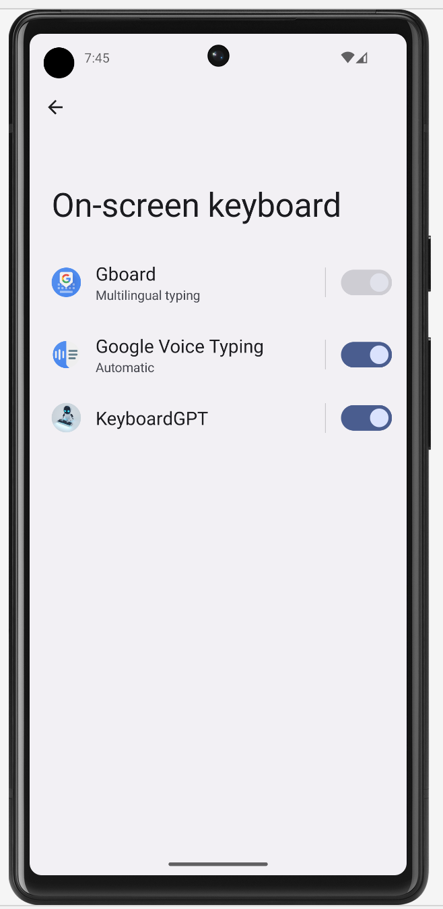
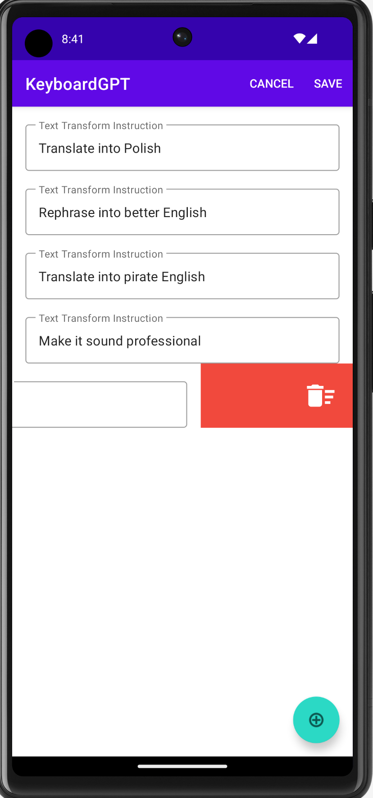
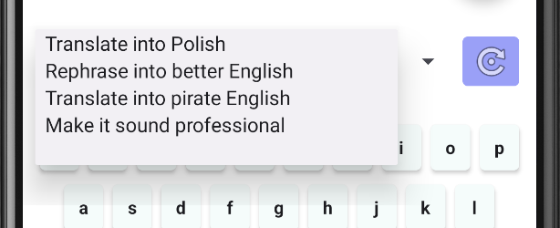
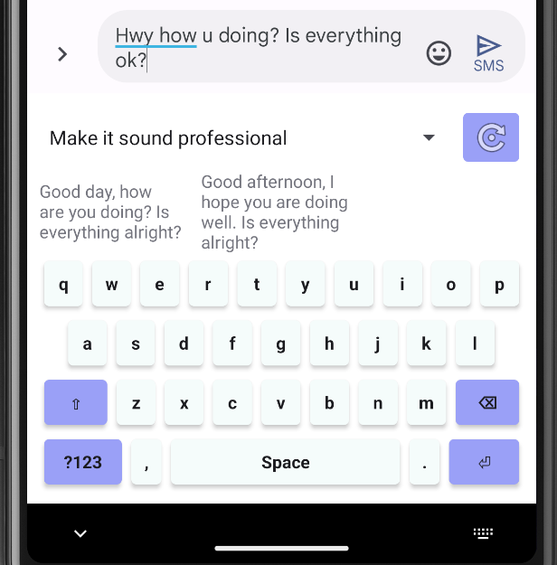

# KeyboardGPT

This is an Android keyboard application that uses OpenAI's LLM (Large Language Model) API to generate
text suggestions. Requests are not sent to OpenAI directly, but through a backend that acts as a proxy,
requiring credits to be purchased in order to use the text suggestions.

The point of this application is to explore the possibilities of using a large language model to generate
text suggestions for a keyboard application. From the initial testing it was obvious that the latency is
too high to be used instead of the traditional n-gram model running on the device for evaluating predictions
after every keystroke, but having a dedicated button that generates suggestions for the currently typed text
with user-specified prompts is still extremely useful. The ideal keyboard application would use both the n-gram
model and the large language model to generate suggestions.

# Requirements

Android version 8.0 or higher is required to run this application.

# How to use

## Enable keyboard

  

    After installing the app enable the keyboard from system settings. It will then be selectable as an input source.
  

  

    
  

## Sign in
Use your Google account to sign in.

## Credits
If you have no credits available, press the "Purchase Credits" button, which will redirect you to https://chattergpt.net.
Sign in and purchase credits via any of the available payment methods, provided by [Stripe](https://stripe.com/).

## Settings

  

    Visit the settings page, accessible from the main screen's action bar and add your custom prompts.
  

  

    
  

## Keyboard Usage

  

    Choose any of the previously configured prompts from the keyboard's spinner picker.
  

  

    
  

 
 

  

    Type some text and press the button right to the prompt spinner to retrieve a suggestion.
  

  

    
  

# Features

- OpenAI API Integration: Generates relevant text suggestions based on user inputs by utilizing OpenAI's advanced language model

- Secure API Requests: The app employs JWT tokens issued by Google's authorization server to ensure secure and authenticated communication with the API

- Customizable Prompts: Allows users to create and configure personalized prompts, allowing unlimited possibilities

- Multiple Suggestions: Provides up to three AI-based suggestions at once, allowing for quickly switching between different prompt types

- Credit Purchasing: Facilitates the purchase of credits through a secure backend system, with transactions managed by the server

- Backend Credit Management: Optimizes credit management for text suggestions using a backend server that functions as a proxy for the OpenAI API

- User Authentication: Offers a secure and hassle-free sign-in process by integrating Google account authentication

- Soft Touch Keyboard: Includes a fully functional soft touch keyboard with numbers, symbols, and special keys for an enhanced typing experience

- Firebase Integration: Securely stores user keystroke and AI completion request counters for future analysis and improvements

# Backend Server

The backend application responsible for user authentication, credit management, and serving as a proxy between the app and OpenAI can be found here: https://github.com/bOsowski/ChatterGpt